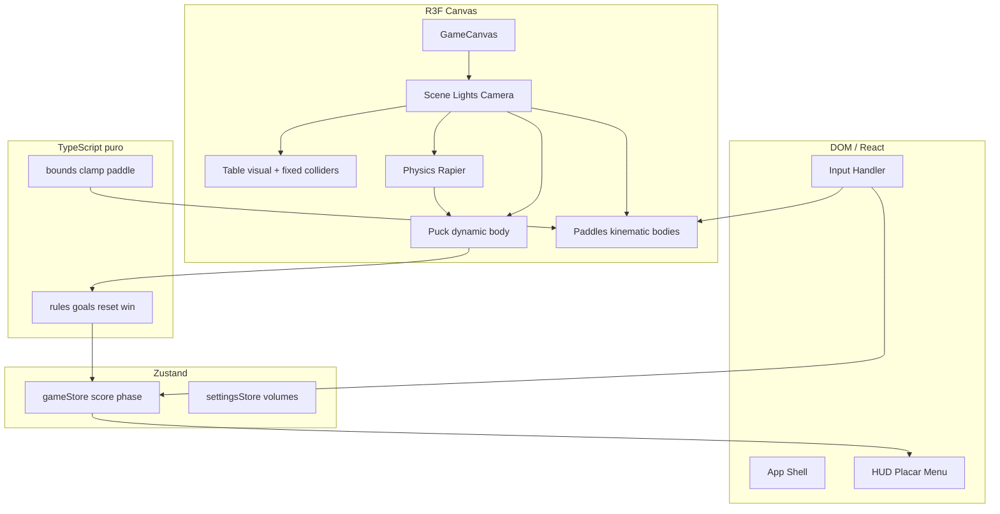

# Arquitetura

## Diagrama de módulos



## Fluxo de dados (frame)

1. **Input** (teclado/mouse) → atualiza alvo da raquete ou velocidade kinematic (refs / store de primitivos).
2. **Physics step** (timestep fixo 1/60 s) → Rapier integra disco e colisões.
3. **Sync** → meshes espelham `translation()` / `rotation()` dos RigidBodies (sem setState).
4. **Rules** → sensores de gol, reset de posições, incremento de placar (eventos discretos → Zustand).
5. **HUD** → re-render apenas em mudança de score/fase (selectors).

## Estrutura de pastas proposta

```
hockey-table/
├── docs/                    # Planejamento e ADRs
├── public/
│   └── models/              # GLB (P1+)
├── src/
│   ├── app/
│   │   ├── App.tsx
│   │   └── providers.tsx
│   ├── components/
│   │   ├── canvas/
│   │   │   ├── GameCanvas.tsx
│   │   │   └── Scene.tsx
│   │   ├── table/
│   │   ├── puck/
│   │   ├── paddle/
│   │   └── ui/
│   │       └── HUD.tsx
│   ├── stores/
│   │   ├── gameStore.ts
│   │   └── settingsStore.ts
│   ├── systems/
│   │   ├── rules.ts
│   │   └── bounds.ts
│   ├── hooks/
│   │   ├── useKeyboardPaddle.ts
│   │   └── usePaddleTarget.ts
│   ├── constants/
│   │   ├── table.ts
│   │   └── physics.ts
│   └── types/
│       └── game.ts
├── AGENTS.md
└── package.json
```

## Interfaces TypeScript (contratos)

```typescript
// types/game.ts
type GamePhase = 'menu' | 'playing' | 'goal' | 'gameOver';

interface GameState {
  phase: GamePhase;
  scoreP1: number;
  scoreP2: number;
  winner: 1 | 2 | null;
  winTarget: number; // default 7
}

interface PaddleInput {
  playerId: 1 | 2;
  targetX: number;
  targetZ: number;
}

interface PuckSnapshot {
  x: number;
  z: number;
  vx: number;
  vz: number;
}
```

## ADRs (Architecture Decision Records)

### ADR-001: React Three Fiber em vez de Three.js imperativo

**Contexto:** Equipe familiar com React; MVP precisa iterar cena rapidamente.

**Decisão:** R3F + drei como camada principal.

**Consequências:** (+) Componentização, ecossistema Poimandres. (−) Disciplina obrigatória contra re-renders no loop.

**Alternativa rejeitada:** Three.js puro — melhor para engine custom, pior DX para HUD + prototipagem rápida.

---

### ADR-002: Rapier via @react-three/rapier

**Contexto:** Colisões disco × raquete rápida exigem motor estável e CCD.

**Decisão:** Rapier com colliders `ball` / `cuboid` apenas.

**Consequências:** (+) WASM performático, integração R3F madura. (−) Curva de tuning; sem trimesh na mesa no MVP.

**Alternativa rejeitada:** Cannon-es — menos mantido; física custom 2D — duplica trabalho e perde eixo Y para futuro 3D.

---

### ADR-003: Vite em vez de Next.js

**Contexto:** Jogo 100% client-side; sem SEO/SSR.

**Decisão:** Vite + React + TypeScript.

**Consequências:** (+) HMR rápido, config mínima. (−) Sem rotas server; aceitável para MVP.

---

### ADR-004: Zustand com selectors para estado de jogo

**Contexto:** Placar e fases discretas; posições 3D contínuas não devem re-renderizar a árvore React.

**Decisão:** `gameStore` para score/phase; posições via refs + `getState()` em `useFrame`.

**Consequências:** (+) HUD isolado. (−) Duas fontes de verdade — documentado em `04-physics-tuning.md`.

---

### ADR-005: Gameplay no plano XZ, câmera oblíqua fixa

**Contexto:** Air hockey real é essencialmente 2D; visual 3D vende o produto.

**Decisão:** Mesa horizontal; câmera perspectiva ~35–45°; raquetes limitadas a Y fixo.

**Consequências:** (+) Física previsível, coliders baratos. (−) Sem salto/peças aéreas no MVP.
